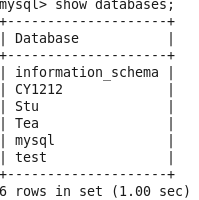
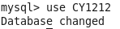

## 一、启动与退出

1、进入 MySQL：  
输入命令：`mysql -uroot -p`  
直接输入安装时的密码即可。  
此时的提示符是：mysql>  
2、退出 MySQL：`quit` 或 `exit`  
3、数据库清屏命令：`system clear`;

## 二、库操作

1、创建数据库  
命令：`create database <数据库名>`  
例如：建立一个名为 stu 的数据库

```
mysql> create database stu;
```

2、显示所有的数据库  
命令：`show databases （注意：最后有个 s）`

```
mysql> show databases;
```

如下图所示：



3、删除数据库  
命令：`drop database <数据库名>`  
例如：删除名为 stu 的数据库

```
mysql> drop database stu;
```

4、连接数据库  
命令： `use <数据库名>`  
例如：如果 CY1212 数据库存在，尝试存取它：

```
mysql> use CY1212;
```

屏幕提示：`Database changed`  
如下图所示：



5、查看当前使用的数据库  
mysql> `select database();`  
6、当前数据库包含的表信息：  
mysql> `show tables; （注意：最后有个 s）`  
7、查看一个库的创建信息

```
show create database <库名>；
```
